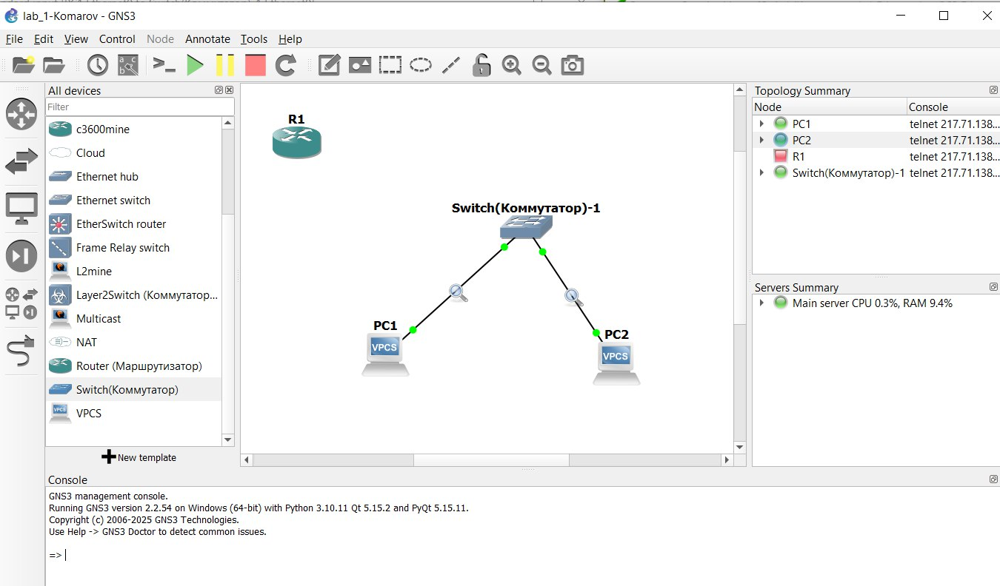
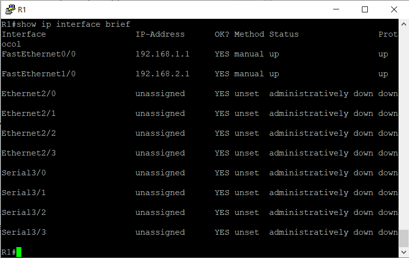
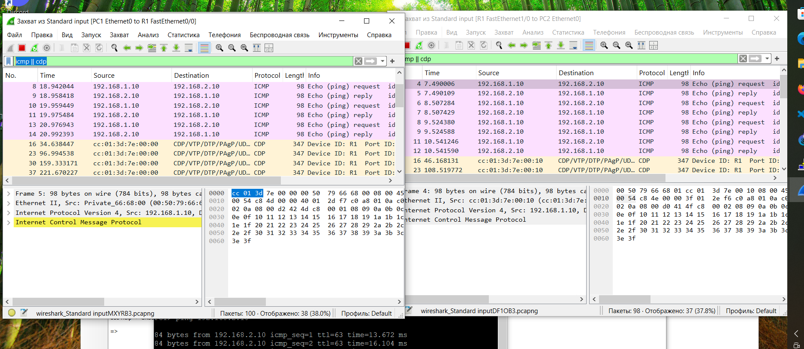

# Конфигурации сети




Bash для компьютеров (при коммутаторе насторйки подсети не нужны, компьютеры в одной сети 192.168.1.10, 192.168.1.20):

* На PC1 (подсеть 192.168.1.0/24):
ip 192.168.1.10 192.168.1.1 24

* На PC2 (подсеть 192.168.2.0/24):
ip 192.168.2.10 192.168.2.1 24

Bash для маршрутизатора:

```bash
enable
configure terminal

# Настройка интерфейса для PC1 (Fa0/0)
interface FastEthernet0/0
 ip address 192.168.1.1 255.255.255.0
 no shutdown
 exit

# Настройка интерфейса для PC2 (Fa0/1)
interface FastEthernet0/1
 ip address 192.168.2.1 255.255.255.0
 no shutdown
 exit

# Включение маршрутизации (если не включена по умолчанию)
ip routing
end
```
# настройка R1



# ping адресса (аналогично c маршрутизатором)


# пакты сети (каммутатор)


# пакты сети (маршрутизатор)

