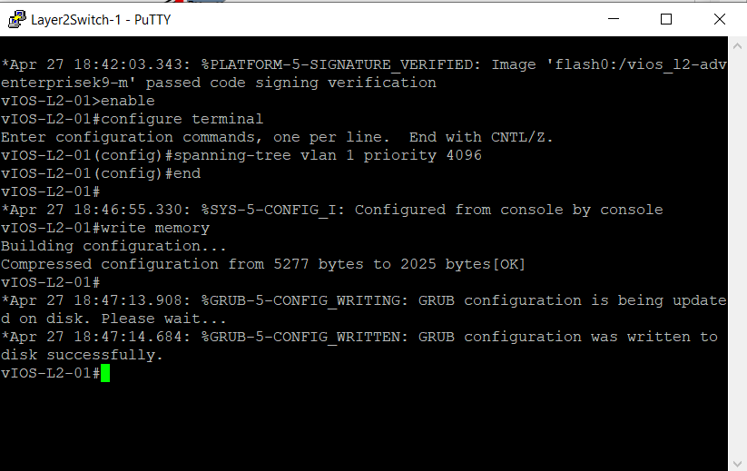
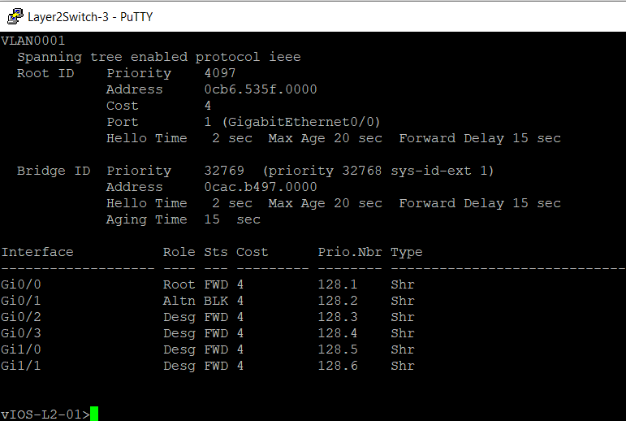
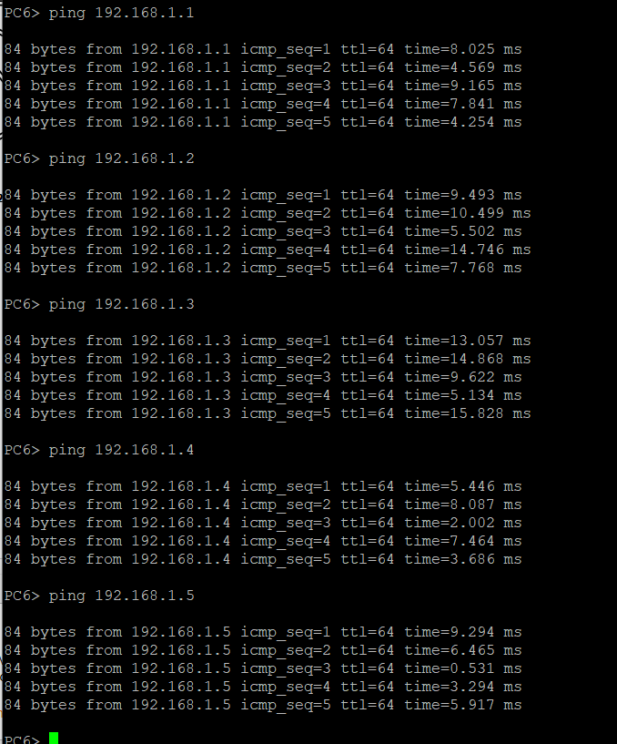
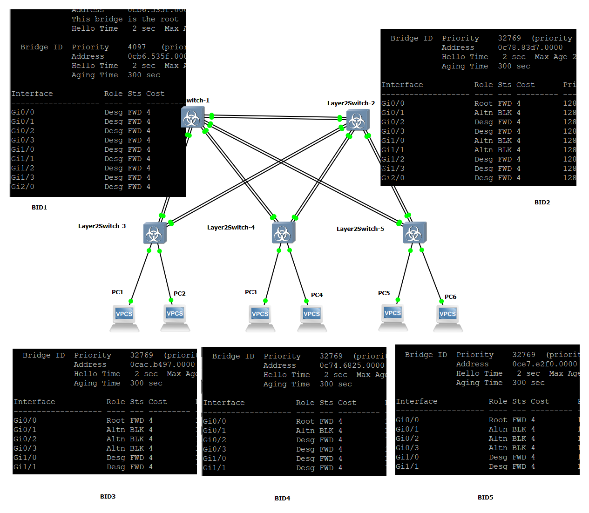
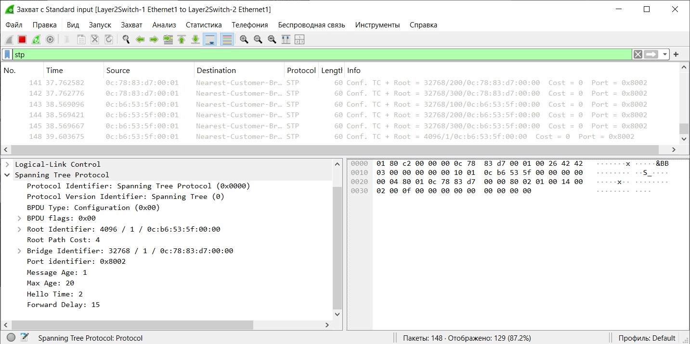
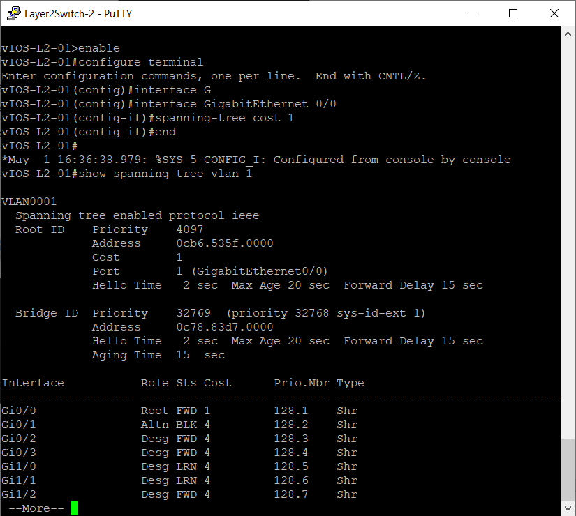

# Настройка протокола STP (IEEE 802.1D)

## 1. Для заданной на схеме schema-lab2 сети, состоящей из управляемых коммутаторов и персональных компьютеров настроить протокол STP, назначив явно один из коммутаторов корневым настройкой приоритета

**Команды настройки (на Layer2Switch-1):**

```bash
enable
configure terminal
spanning-tree vlan 1 priority 4096
end
write memory

#Проверка 
show spanning-tree vlan 1
```




## 2. Проверить доступность каждого с каждым всех персональных компьютеров (VPCS), результаты запротоколировать



**Примечание: я не собираюсь пинговать каждый компьютер с каждого, это глупо**

## 3. На изображении схемы отметить BID каждого коммутатора и режимы работы портов (RP/DP/blocked) и стоимости маршрутов, результат сохранить в файл

**СХЕМА**



## 4. При помощи wireshark отследить передачу пакетов hello от корневого коммутатора на всех линках (nb!), результаты включить в отчет



**Примечание: на остальных 8 линках картина анологична**

## 5. Изменить стоимость маршрута для порта RP произвольного назначенного (designated) коммутатора, повторить действия из п.3, результат сохранить в отдельный файл



```bash
enable
configure terminal
interface GigabitEthernet 0/0
spanning-tree cost 1
end
write memory
```

## 6. Сохранить файлы конфигураций устройств в виде набора файлов с именами, соответствующими именам устройств

**Конфигурации коммутаторов:**

[config_switch_1](configs/config_switch_1.txt)

[config_switch_2](configs/config_switch_2.txt)

[config_switch_3](configs/config_switch_3.txt)

[config_switch_4](configs/config_switch_4.txt)

[config_switch_5](configs/config_switch_5.txt)