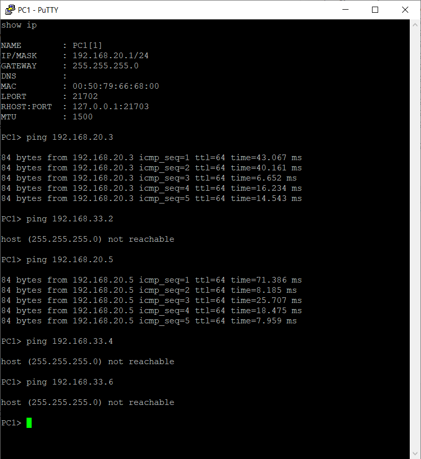
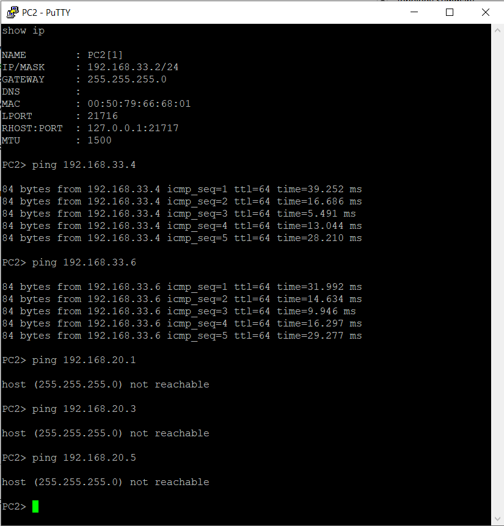
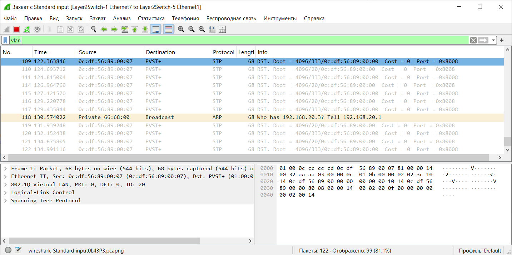
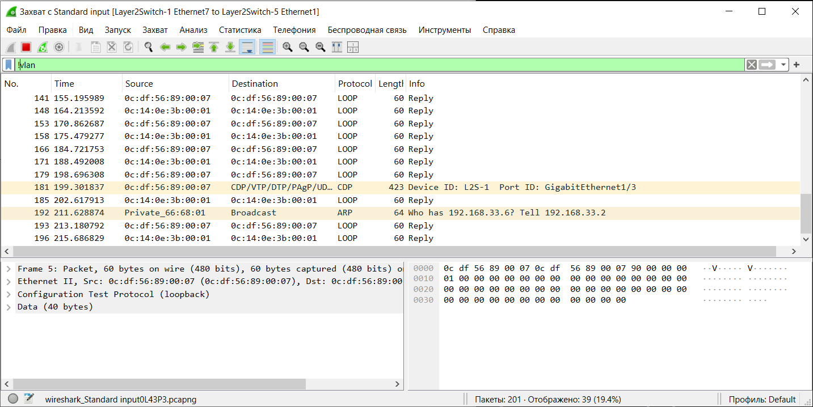

# Тема: Настройка виртуальной локальной сети (VLAN)

## 1. Для заданной на схеме schema-lab3 сети, состоящей из управляемых коммутаторов и персональных компьютеров настроить на коммутаторах логическую топологию используя протокол IEEE 802.1Q, для передачи пакетов VLAN333 между коммутаторами использовать Native VLAN

**ip адреса PC1-6**
```bash
# VLAN 20
PC1> ip 192.168.20.1 255.255.255.0
PC3> ip 192.168.20.3 255.255.255.0
PC5> ip 192.168.20.5 255.255.255.0

# VLAN 333
PC2> ip 192.168.33.2 255.255.255.0
PC4> ip 192.168.33.4 255.255.255.0
PC6> ip 192.168.33.6 255.255.255.0
```
Далее идут настройки для каждого из Switch. Hostname L2S-(1-6).
Повторить для всех шести.

**настройка VLAN20 и VLAN333**
```bash
enable
configure terminal

hostname L2S-1 #не обязательно

no ip domain-lookup
spanning-tree mode rapid-pvst
service password-encryption
spanning-tree vlan 20 priority 4096 ##8192
spanning-tree vlan 333 priority 4096 ##8192

# Создаём VLANы
vlan 20
 name VLAN20
exit

vlan 333
 name VLAN333
exit

end 
write memory
```

**Натсройка Trunc **
```bash
enable
conf t
interface range GigabitEthernet0/0 - 3    #в зависимости от колво связных switch
description *** Trunk ***                 #не обязательно
 switchport trunk encapsulation dot1q
 switchport mode trunk
 switchport trunk native vlan 333
 switchport trunk allowed vlan 20,333
exit

interface range GigabitEthernet1/0 - 3    #в зависимости от колво связных switch
description *** Trunk *** 
 switchport trunk encapsulation dot1q
 switchport mode trunk
 switchport trunk native vlan 333
 switchport trunk allowed vlan 20,333
exit

end
write memory
```

**Натсройка Access 3,4,5 switch для PC 1-6**
```bash
enable
configure terminal

interface GigabitEthernet1/0    #PC1 - VLAN20 PC3, PC5
 switchport mode access
 switchport access vlan 20
exit

interface GigabitEthernet1/1    #PC2 - VLAN333 PC4, PC6
 switchport mode access
 switchport access vlan 333
exit
end
write memory
```


## 2. Проверить доступность персональных компьютеров, находящихся в одинаковых VLAN и недоступность находящихся в различных, результаты задокументировать

**VLAN20**





**VLAN333**




## 3. Перехватить в WireShark пакеты с тегами и без тегов (nb!), результаты задокументировать

**VLAN20**





**VLAN333**





## 4. Сохранить файлы конфигураций устройств в виде набора файлов с именами, соответствующими именам устройств

[config_switch_1](configs/config_switch_1.txt)

[config_switch_2](configs/config_switch_2.txt)

[config_switch_3](configs/config_switch_3.txt)

[config_switch_4](configs/config_switch_4.txt)

[config_switch_5](configs/config_switch_5.txt)