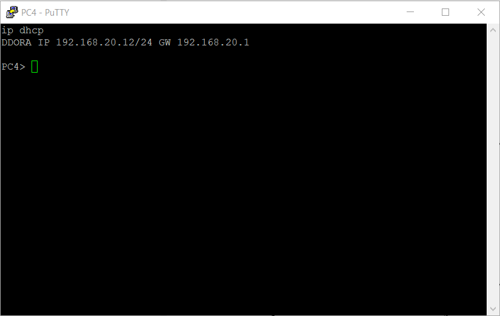
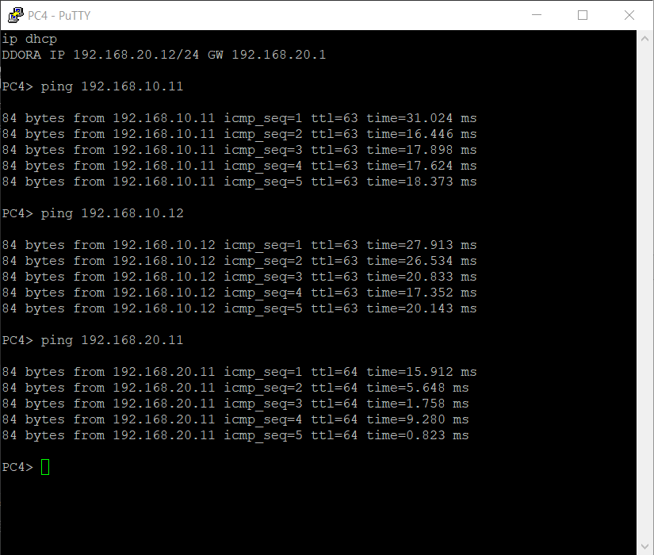

# Тема: Настройка протокола DHCP

## 1. Для заданной на схеме schema-lab4 сети, состоящей из управляемых коммутаторов, маршрутизаторов и персональных компьютеров выполнить планирование и документирование адресного пространства в подсетях LAN1, LAN2, LAN3 и назначить статические адреса маршрутизаторам и динамическое конфигурирование адресов для VPC

**Статические адреса на маршрутизаторах:**

R1:

- Fa0/0 (LAN1): 192.168.10.1/24
- Fa2/0 (LAN2): 192.168.20.1/24
- Fa1/0 (к R2): 192.168.1.1/30

```bash

enable
conf t

interface FastEthernet0/0
 ip address 192.168.10.1 255.255.255.0
 no shutdown

interface FastEthernet2/0
 ip address 192.168.20.1 255.255.255.0
 no shutdown

interface FastEthernet1/0
 ip address 192.168.1.1 255.255.255.252
 no shutdown

exit
ip routing
end
write memory

```

R2:

- Fa0/0 (к R1): 192.168.1.2/30

```bash
enable
conf t

interface FastEthernet0/0
 ip address 192.168.1.2 255.255.255.252
 no shutdown

exit
ip routing
end
write memory
```


## 2. Настроить сервер DHCP на маршрутизаторе R2 для обслуживания адресных пулов адресного пространства подсетей LAN1 и LAN2

**DHCP Server (для LAN1 и LAN2)**

```bash
conf t

ip dhcp excluded-address 192.168.10.1 192.168.10.10
ip dhcp excluded-address 192.168.20.1 192.168.20.10

#Пул LAN1
ip dhcp pool LAN1
 network 192.168.10.0 255.255.255.0
 default-router 192.168.10.1
 dns-server 8.8.8.8 1.1.1.1
 lease 1 0

#Пул LAN2
ip dhcp pool LAN2
 network 192.168.20.0 255.255.255.0
 default-router 192.168.20.1
 dns-server 8.8.8.8 1.1.1.1
 lease 1 0

end
write memory
```
**DHCP Relay R1**

```bash
conf t
interface FastEthernet0/0          # порт в LAN1
 ip helper-address 192.168.1.2

interface FastEthernet2/0          # порт в LAN2
 ip helper-address 192.168.1.2
exit
end
write memory
```

## 3. Настроить статическую (nb!) маршрутизацию между подсетями

R1:

```bash
conf t
ip route 0.0.0.0 0.0.0.0 192.168.1.2
write memory
```
R2:

```bash
conf t
ip route 192.168.10.0 255.255.255.0 192.168.1.1
ip route 192.168.20.0 255.255.255.0 192.168.1.1
ip route 0.0.0.0 0.0.0.0 192.168.1.1
end
write memory
```


## 4. Проверить работоспособность протокола DHCP и маршрутизации, выполнив ping между всеми VPC

**DHCP VPC1-4**





**ping VPC1-4**



## 5. Перехватить в wireshark диалог одного из VPC с сервером DHCP, разобрать с комментариями

**Wire dhpc**

[ping](screens/wire.png)


**Примечание:**
- 6811 DHCP [Discover] 0.0.0.0 -> 255.255.255.255 - Клиент (VPC в LAN2) только что включился или сделал ip dhcp. Отправляет broadcast-запрос в поисках DHCP-сервера
- 6812 DHCP [Offer] 192.168.20.1 -> 192.168.20.12 - R1 (как DHCP Relay) получил Offer от настоящего сервера (R2) и переслал его клиенту. Предлагает адрес 192.168.20.12
- 6813 DHCP [Request] 0.0.0.0 -> 255.255.255.255 - Клиент соглашается с предложенным адресом и запрашивает его у сервера (broadcast).
- 6814 DHCP [ACK] 192.168.20.1 -> 192.168.20.12 - Подтверждение от R1 (relay). Клиент официально получает IP 192.168.20.12.

## 6. Сохранить файлы конфигураций устройств в виде набора файлов с именами, соответствующими именам устройств

[config_R1](configs/config_R1.txt)

[config_R2](configs/config_R2.txt)