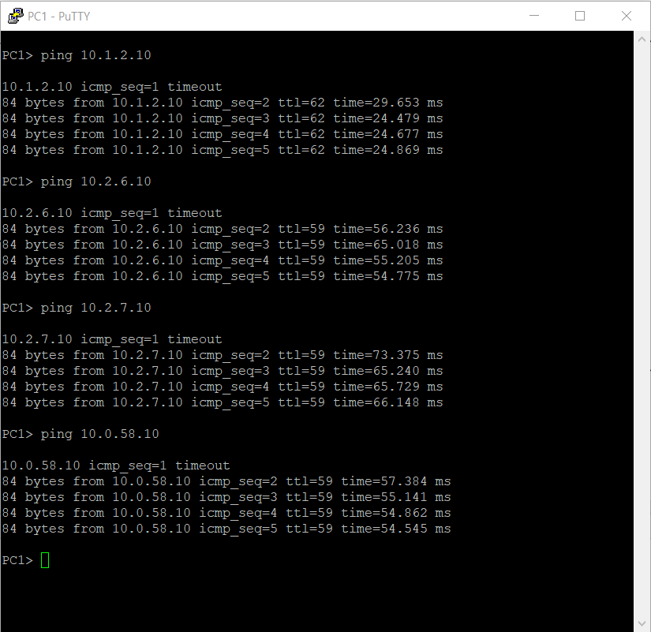
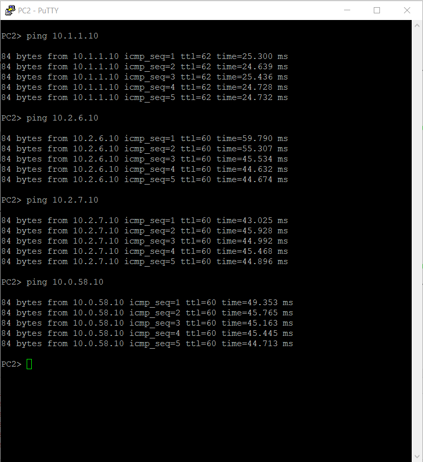
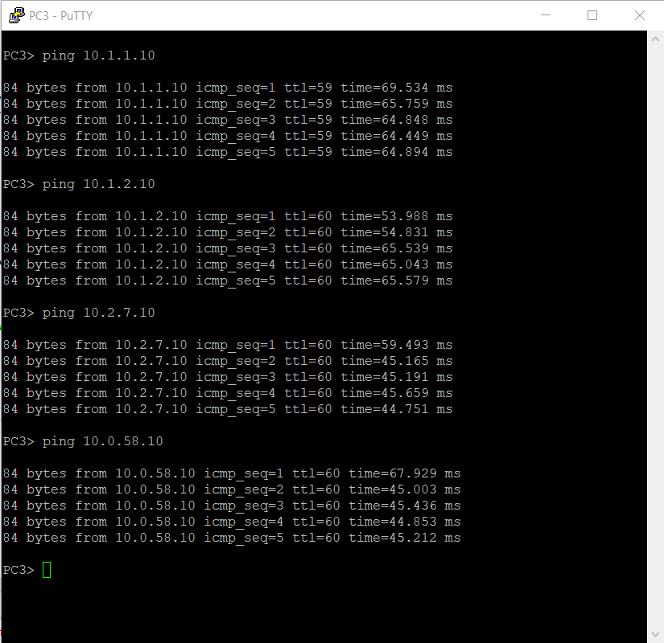
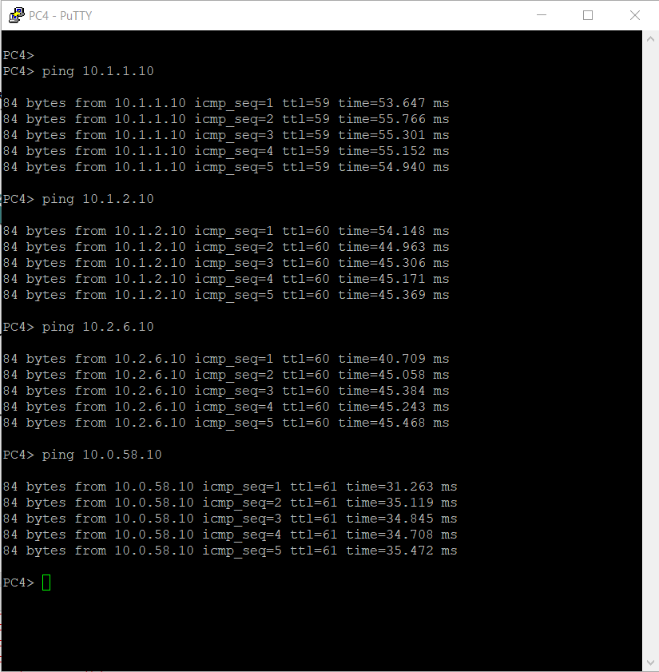
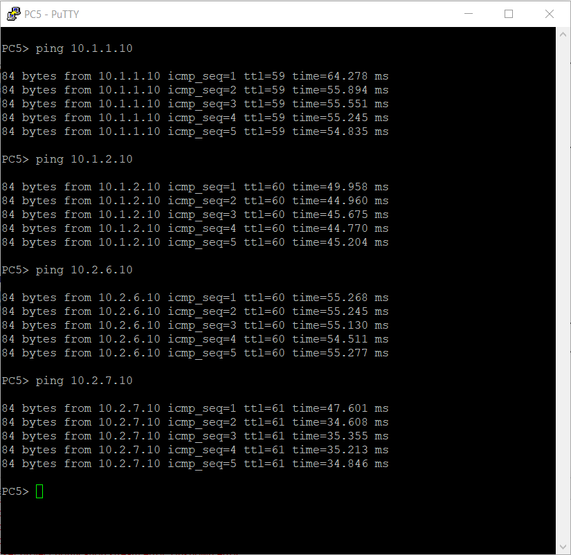
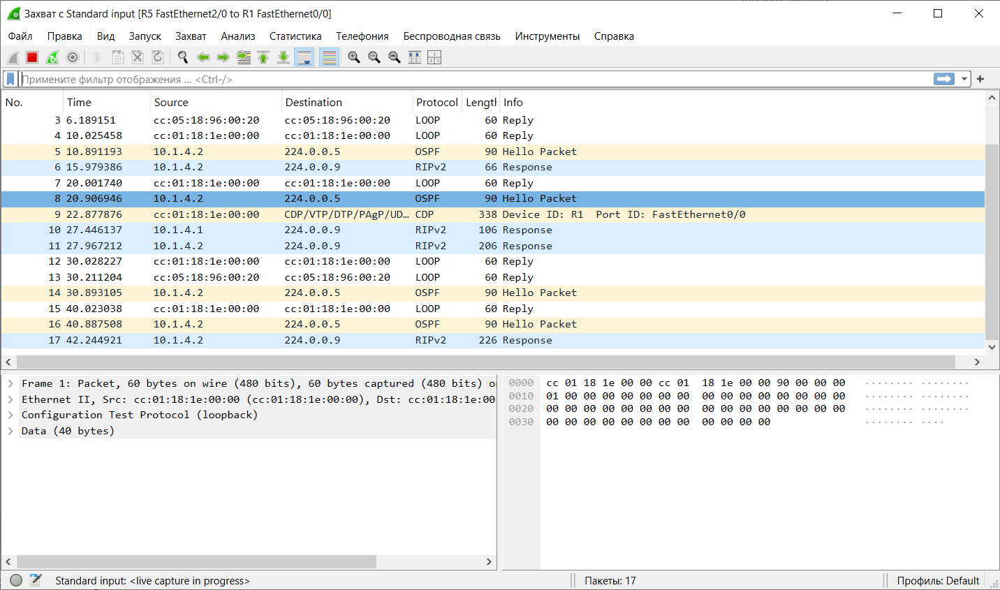

# Тема: Настройка протоколов динамической маршрутизации RIP v2 и OSPF


## 1. Для заданной на схеме schema-lab5 сети, состоящей из управляемых коммутаторов, маршрутизаторов и персональных компьютеров выполнить планирование и документирование адресного пространства и назначить статические адреса всем устройствам. nb! Каждое соединение маршрутизатора с маршрутизатором - это отдельная сеть.

**Списки адресов**

RIP v2:

Устройство, Интерфейс,      IP-адрес,   Маска,      Шлюз
- PC1,        eth0,           10.1.1.10,  /24,        10.1.1.1
- R4,         Fa0/0 (to PC1), 10.1.1.1,   /24,        -
- R4,         Fa1/0 (to R5),  10.1.3.1,   /24,        -
- PC2,        eth0,           10.1.2.10,  /24,        10.1.2.1
- R5,         Fa0/0 (to PC2), 10.1.2.1,   /24,        -
- R5,         Fa1/0 (to R4),  10.1.3.2,   /24,        -
- R5,         Fa2/0 (to R1),  10.1.4.1,   /24,        -
- R1,         Fa0/0 (to R5),  10.1.4.2,   /24,        -

OSPF Area 0:

Устройство, Интерфейс,  IP-адрес,   Маска
- R1,         Fa1/0,      10.0.10.1,  /24
- R2,         Fa0/0,      10.0.10.2,  /24
- R3,         Fa0/0,      10.0.10.3,  /24

OSPF Area 1:

Устройство, Интерфейс,      IP-адрес,   Маска,  Шлюз
- R3,         Fa2/0 (to R8),  10.0.38.1,  /24,    -
- R8,         Fa0/0 (to R3),  10.0.38.2,  /24,    -
- R8,         Fa1/0 (to PC5), 10.0.58.1,  /24,    -
- PC5,        eth0,           10.0.58.10, /24,    10.0.58.1

OSPF Area 2:

Устройство, Интерфейс,      IP-адрес,   Маска,  Шлюз
- R2,         Fa1/0 (to R6),  10.0.26.1,  /24,    -
- R6,         Fa0/0 (to R2),  10.0.26.2,  /24,    -
- R6,         Fa2/0 (to R7),  10.0.67.1,  /24,    -
- R6,         Fa1/0 (to PC3), 10.2.6.1,   /24,    -
- R3,         Fa1/0 (to R7),  10.0.37.1,  /24,    -
- R7,         Fa0/0 (to R3),  10.0.37.2,  /24,    -
- R7,         Fa2/0 (to R6),  10.0.67.2,  /24,    -
- R7,         Fa1/0 (to PC4), 10.2.7.1,   /24,    -
- PC3,        eth0,           10.2.6.10,  /24,    10.2.6.1
- PC4,        eth0,           10.2.7.10,  /24,    10.2.7.1

Подсети:

- 10.1.1.0/24 — PC1
- 10.1.2.0/24 — PC2
- 10.1.3.0/24 — R4–R5
- 10.1.4.0/24 — R5–R1
- 10.0.10.0/24 — OSPF Area 0 (R1, R2, R3)
- 10.0.26.0/24 — R2–R6
- 10.0.37.0/24 — R3–R7
- 10.0.38.0/24 — R3–R8
- 10.0.58.0/24 — R8–PC5
- 10.0.67.0/24 — R6–R7
- 10.2.6.0/24 — PC3
- 10.2.7.0/24 — PC4

**Команды назначения**

R*:

```bash
conf t
interface FastEthernet-/-
 ip address <ip> <mask>
 no shutdown
exit
write memory
```

PC:

```bash
ip <ip> /<mask> <gw>
save
```

## 2. Настроить протокол динамической маршрутизации RIP v2 для области, указанной на схеме schema-lab5.

**Настройка RIP V2**

R4:

```bash
conf t
router rip
 version 2
 no auto-summary
 network 10.1.1.0
 network 10.1.3.0
 passive-interface FastEthernet0/0 
exit
end
write memory
```

R5:

```bash
conf t
router rip
 version 2
 no auto-summary
 network 10.1.3.0
 network 10.1.2.0
 network 10.1.4.0
 passive-interface FastEthernet0/0 
exit
end
write memory
```

R1

```bash
conf t
router rip
 version 2
 no auto-summary
 network 10.1.4.0
 passive-interface FastEthernet1/0  
exit
end
write memory
```

## 3.Настроить протокол динамической маршрутизации OSPF для зон 0, 1, 2. Зону 1 настроить как полностью (nb!) тупиковую.

**OSPF**

R1:

```bash
conf t
router ospf 1
 router-id 1.1.1.1
 network 10.0.10.0 0.0.0.255 area 0
 network 10.1.4.0 0.0.0.255 area 0
exit
end
write memory
```

R2:

```bash
conf t
router ospf 1
 router-id 2.2.2.2
 network 10.0.10.0 0.0.0.255 area 0
 network 10.0.26.0 0.0.0.255 area 2
exit
end
write memory
```

R6:

```bash
conf t
router ospf 1
 router-id 6.6.6.6
 network 10.0.26.0 0.0.0.255 area 2
 network 10.0.67.0 0.0.0.255 area 2
 network 10.2.6.0 0.0.0.255 area 2
exit
end
write memory
```

R7:

```bash
conf t
router ospf 1
 router-id 7.7.7.7
 network 10.0.37.0 0.0.0.255 area 2
 network 10.0.67.0 0.0.0.255 area 2
 network 10.2.7.0 0.0.0.255 area 2
exit
end
write memory
```

**Totally Stubby**

R3:

```bash
conf t
router ospf 1
 router-id 3.3.3.3
 network 10.0.10.0 0.0.0.255 area 0
 network 10.0.38.0 0.0.0.255 area 1
 network 10.0.37.0 0.0.0.255 area 2
 area 1 stub no-summary
exit
end
write memory
```

R8:

```bash
conf t
router ospf 1
 router-id 8.8.8.8
 network 10.0.38.0 0.0.0.255 area 1
 network 10.0.58.0 0.0.0.255 area 1
 area 1 stub
exit
end
write memory
```

## 4. Настроить редистрибуцию маршрутов между протоколами RIP v2 и OSPF.

**R1 RIP -> OSPF:**

```bash
conf t
router ospf 1
 redistribute rip subnets
exit
end
write memory
```

**R1 OSPF -> RIP:**

```bash
conf t
router rip
 redistribute ospf 1 metric 1
exit
end
write memory
```

## 5. Проверить работоспособность маршрутизации, выполнив ping VPC "все между всеми" (nb!: в обе стороны).

**PING PC1**



**PING PC2**



**PING PC3**



**PING PC4**



**PING PC5**



## 6. Перехватить в wireshark сообщения протоколов RIP v2 и OSPF, идентифицировать их тип и содержание.

**WireShark**




**RIP v2**

Найденные пакеты:

- Тип пакета: Response
- Destination: 224.0.0.9 (мультикаст RIP v2)
- Source: 10.1.4.1 (R5) и 10.1.4.2 (R1)
- Примеры пакетов: №6, №10, №11, №17

Содержание пакета:

- Версия: 2
- Команда: Response (2)
- Передаются маршруты с метрикой (например, сети из RIP-домена и редистрибутированные из OSPF)
- Используется UDP порт 520

**OSPF**

Найденные пакеты:

- Тип пакета: Hello Packet (тип 1)
- Destination: 224.0.0.5 (All OSPF Routers)
- Source: 10.1.4.2 (R1)
- Примеры пакетов: №5, №8, №14, №16

Содержание OSPF Hello Packet:

- Router ID: 1.1.1.1 (R1)
- Area ID: 0.0.0.0 (Area 0)
- Network Mask: 255.255.255.0
- Hello Interval: 10 сек
- Dead Interval: 40 сек
- Neighbor: пусто (на этом линке, т.к. R5 не участвует в OSPF)

## 7. Сохранить в отдельные файлы с префиксом rt_ и именем маршрутизатора таблицы маршрутизации всех маршрутизаторов.

[rt_R1](rt/rt_1.txt)

[rt_R2](rt/rt_2.txt)

[rt_R3](rt/rt_3.txt)

[rt_R4](rt/rt_4.txt)

[rt_R5](rt/rt_5.txt)

[rt_R6](rt/rt_6.txt)

[rt_R7](rt/rt_7.txt)

[rt_R8](rt/rt_8.txt)

## 8. Сохранить файлы конфигураций устройств в виде набора файлов с именами, соответствующими именам устройств.

[config_R1](configs/R1_config.txt)

[config_R2](configs/R2_config.txt)

[config_R3](configs/R3_config.txt)

[config_R4](configs/R4_config.txt)

[config_R5](configs/R5_config.txt)

[config_R6](configs/R6_config.txt)

[config_R7](configs/R7_config.txt)

[config_R2](configs/R8_config.txt)