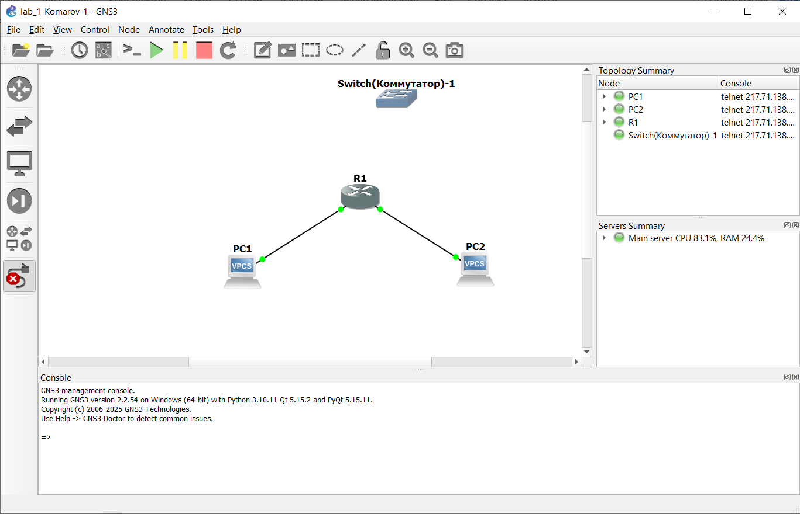
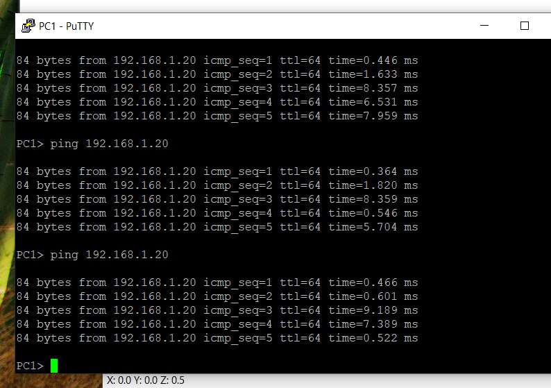
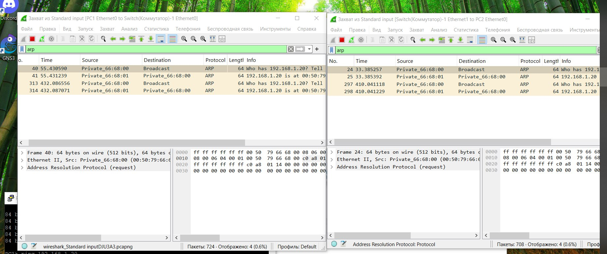

# Конфигурации сети

Bash для маршрутизатора (для коммутатора насторйки подсети не нужны, компьютеры в одной сети 192.168.1.10, 192.168.1.20):

* На PC1 (подсеть 192.168.1.0/24):
ip 192.168.1.10 192.168.1.1 24

* На PC2 (подсеть 192.168.2.0/24):
ip 192.168.2.10 192.168.2.1 24

# ping адресса

# пакты сети

